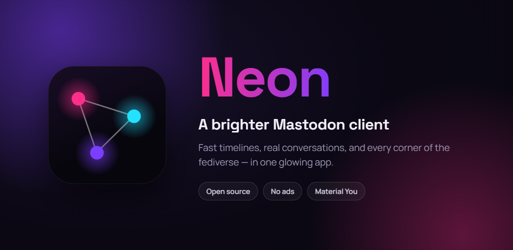
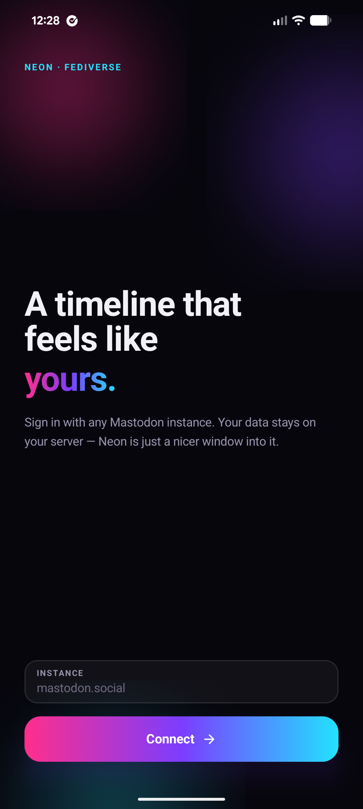
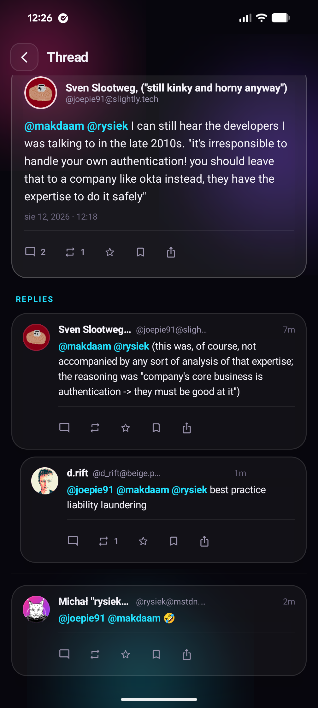
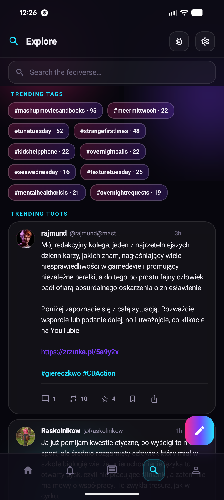
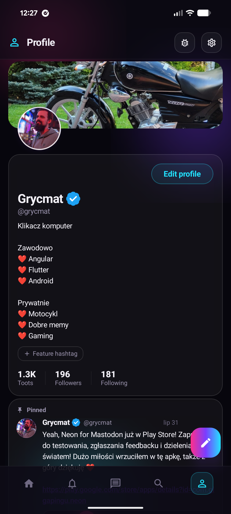
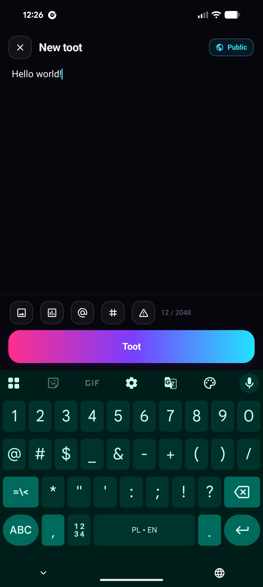
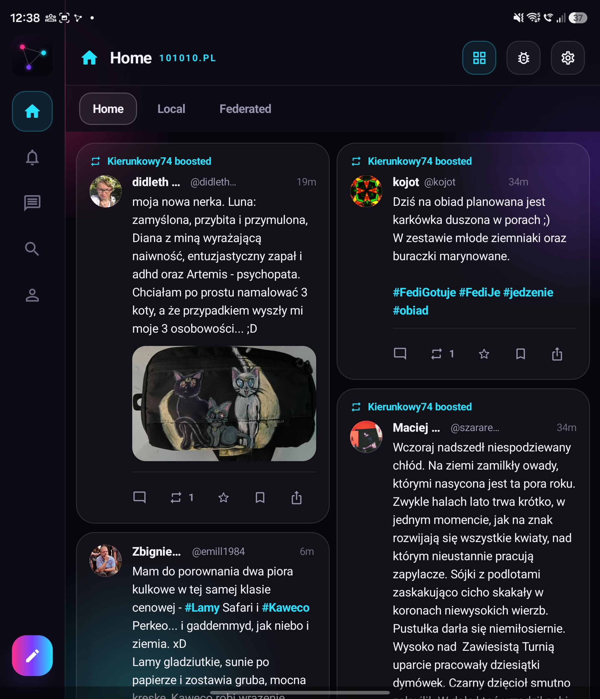
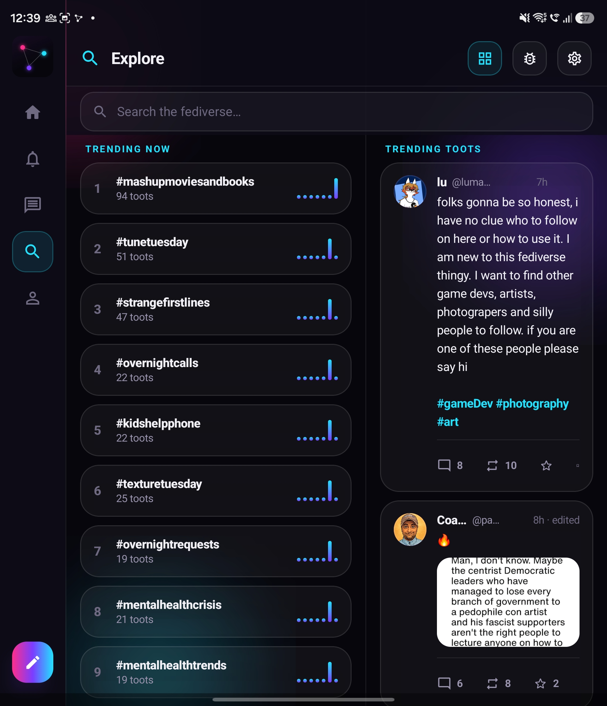
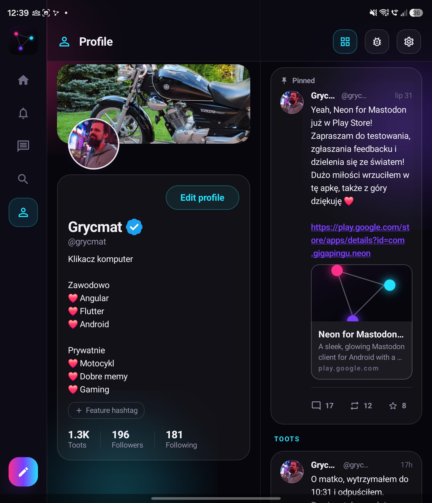
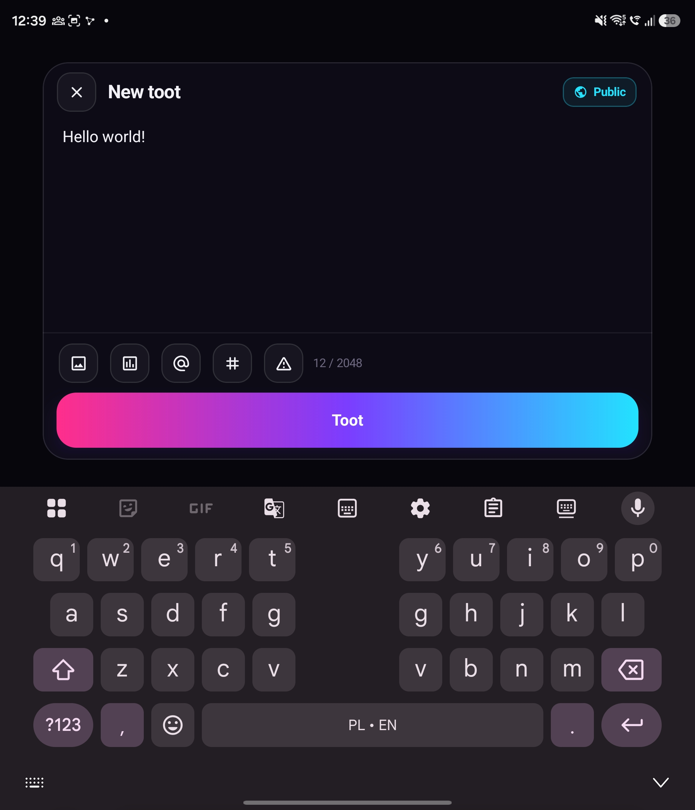

# Neon — Native Android Mastodon Client

An independent, unofficial Mastodon client — not developed by or affiliated
with Mastodon gGmbH.

<p align="center">
  <a href="https://play.google.com/store/apps/details?id=com.gigapingu.neon">
    
  </a>
</p>

<p align="center">
  <a href="https://play.google.com/store/apps/details?id=com.gigapingu.neon">Get it on Google Play</a>
</p>

## Screenshots

### Phone

<p align="center">
  
  
  
  
  
</p>

### Foldable & tablet

<p align="center">
  
  
</p>
<p align="center">
  
  
</p>

## Stack

- **Kotlin 2.2**, JVM 17, AGP 8.11, compileSdk 36 / minSdk 26
- **Jetpack Compose** (Material 3, BOM), bundled static fonts (Space Grotesk + Manrope, SIL OFL 1.1)
- **Navigation 3** (`androidx.navigation3`) — serializable `NavKey`s, `NavDisplay`, ViewModel-scoped entries
- **Hilt** for DI (`@HiltViewModel` per screen, `@Singleton` repositories)
- **OkHttp + kotlinx.serialization** for the Mastodon REST API (dynamic instance host, so no Retrofit)
- **Coil 3** for images, **DataStore** for credentials/settings
- **Jetpack Glance** for the home-screen widget (the one part of the UI that isn't Compose UI — Glance emits `RemoteViews`)

## Modules

```
app                   Auth gate, Navigation 3 wiring, HomeShell (swipeable tabs + TopAppBar + FAB), ShellViewModel
core/model            API entities (Status, Account, Poll, Notification, …)
core/network          ApiClient (OkHttp wrapper bound to instance + token)
core/database         Room cache (list_cache / entity_cache)
core/data             Repositories: Auth, Timeline, Status, Notification, Account, Bookmark, Conversation, Media,
                      Search, Settings, List, Filter, Tag (followed hashtags);
                      push/ (Web Push subscription + on-device decryption);
                      NotificationWidgetBridge (lets the data layer drive the widget without core/* → feature/*)
core/designsystem     NeonPalette/NeonTheme/typography, Glass* components, NeonBackground, HtmlText
core/ui               StatusCard, MediaGrid, PollView, QuoteCard, LinkPreviewCard, StatusActions, AccountRow, AsyncList,
                      VideoPlayer (ExoPlayer), MediaPreviewScreen (interactive full-screen viewer), EditHistorySheet,
                      Navigator + StatusActionService singletons, BigScreen.kt (adaptive UI helpers, hinge width,
                      row select indicator), and NavKeys
feature/auth          Login + in-app OAuth WebView
feature/timeline      Home / Local / Federated with segmented pills, plus hashtag and list timelines
feature/explore       Trends + search (also pushed for hashtag taps)
feature/notifications Notifications feed + filtered-notification requests queue + follow-request review,
                      NeonFirebaseMessagingService + NeonC2dmReceiver + PushMessageHandler + FcmTokenProvider (FCM push)
feature/messages      Direct messages: Conversation list + new-message composer (a Conversation just groups
                      visibility="direct" statuses — Mastodon has no separate DM system)
feature/thread        Thread view (ancestors → focused → replies)
feature/composer      Composer: media + alt text, polls, CW, visibility, @-autocomplete
feature/profile       Profile, follow lists, Bookmarks, edit profile (incl. field editor), list membership
feature/settings      Theme mode + Material You toggle + logout, keyword filters, list management, followed-hashtag management
feature/widget        Home-screen notifications widget (Glance): NotificationWidget + Receiver + Repository,
                      WidgetAvatars (avatar/badge bitmap compositing), NotificationWidgetHost
```

## Features

- **Timelines**: Home, Local, Federated timelines (with pull-to-refresh and "new toots" banner), plus hashtag and list timelines. On the Home tab, tapping the shared TopAppBar scrolls straight to the top and dismisses the "new toots" banner, same as tapping the banner itself.
- **Direct Messages**: Conversation list + recipient picker for starting a new direct message (visibility="direct" statuses, grouped as Mastodon Conversations).
- **Bookmarks**: Dedicated Bookmarks tab/screen to save and view bookmarked statuses.
- **Interactive Thread View**: Full discussion view with collapsible Content Warnings (CW) and sensitive media blur overlays. Long posts in feeds and lists are clipped with a "Show more" hint; the focused status in a thread always renders in full.
- **Follow Requests**: For locked accounts, incoming follow requests can be accepted or rejected inline from a Notifications banner, or from a dedicated Follow requests screen.
- **Status Interactions**: Favourite, boost, vote on polls, share, edit status, delete & re-draft, mute, block, and report accounts (from a status or directly from a profile), plus a favourited/boosted-by sheet and edit history viewer. Hashtags, mentions and links are tappable throughout — in timelines, threads, quoted statuses, edit history and profile bios — jumping to the hashtag timeline, resolving and opening the mentioned profile, or opening the link in the browser.
- **Trust & Safety**: Settings > Safety & Privacy links the published privacy policy / CSAE standards (`privacy_policy.md`) and a "Blocked & muted accounts" screen to review/undo either list.
- **Composer**: Text composer with media attachments, alt text, polls, CW toggle, and visibility settings.
- **Filters, Lists & Followed Hashtags**: Manage keyword filters, custom lists (with per-account membership from a profile), and followed hashtags from Settings; filtered-out notifications land in a review queue.
- **Profile**: Edit profile, including a custom-fields editor, with an accessibility pass over profile screens. The account's Mastodon header/cover photo renders behind the avatar (falling back to the brand gradient when unset); tapping either the header photo or the avatar opens the same full-screen media viewer used for toot media.
- **Dynamic Shell & Navigation**: Translucent bottom tab bar (Home, Explore, Notifications, Profile), shared glassy TopAppBar with feedback and settings actions, custom slide transitions, and predictive back support.
- **Feedback**: Bug-report icon in the TopAppBar (and a "Send feedback" entry in Settings) opens the composer pre-addressed as a locked direct message to the developer's account.
- **Adaptive Layouts**: List-detail dual panes for foldables and tablets (>640dp).
- **Push Notifications**: FCM-delivered Mastodon Web Push, decrypted on-device (RFC 8291), relayed through a self-hosted `mastodon-fcm-relay` so the relay never sees plaintext. Delivered via two manifest entry points — the modern `FirebaseMessagingService` and a legacy C2DM `BroadcastReceiver` mirroring the official Mastodon app — since some OEMs silently drop background `Service` wake-ups well before Doze/App-Standby checks apply (see the "Push notifications" section in `CLAUDE.md`). Taps deep-link to the relevant thread.
- **Home-screen Widget**: Resizable Glance widget listing the newest notifications in the app's own glass styling — avatar with the notification-type badge composited in, name/verb/toot preview/time, an "Updated Xm ago" line and a refresh button. It follows the app's Theme mode setting (falling back to the system's night mode for `System`), renders from the Room cache so it works before the app has ever been opened in that process, and taps deep-link to the thread through the same route push notifications use. It refreshes as notifications arrive: push while backgrounded, streaming while foregrounded, plus in-app mutations, the refresh button, and a staleness-gated fetch on the platform's periodic update. See the "Home-screen widget" section in `CLAUDE.md` for the design constraints (Binder payload budget, Glance's single `goAsync` PendingResult).
- **Material You**: Optional "Match wallpaper colors" toggle in Settings (Android 12+, off by default) re-derives the gradient, avatars, glow and accent ink from the device's wallpaper colors while keeping the glass surfaces and typography untouched; falls back to the static neon palette below API 31 or when off. Paired with a themed (monochrome) launcher icon. See the "Theming & Material You" section in `CLAUDE.md` for the implementation.

Navigation is a plain singleton: `Navigator` in `core/ui` holds the Nav3 back
stack (bound by `NeonApp` while the shell is on screen) and screens call it
directly; `StatusActionService` does the same for favourite/boost/vote/share,
plus resolving tapped mentions and opening tapped links from status/bio text
rendered by `HtmlText`.
Screen transitions slide right-to-left on push and mirror back left-to-right
on pop, with the predictive back gesture driving the same slide. The composer
(`ComposeKey`) overrides this to slide up from the bottom like a sheet and back
down on pop. The predictive back gesture is enabled via `android:enableOnBackInvokedCallback="true"`
in the manifest.

Root shell tabs (Home, Explore, Notifications, Profile) are hosted within a `HorizontalPager` to support swipe navigation, keeping their states alive across page swiping via `beyondViewportPageCount = 3`. A shared, glassmorphic `TopAppBar` displays page context and triggers feedback (bug icon) and settings.

## Previews & Stateless Screens

Screens are split into a stateful ViewModel-connected wrapper and a stateless layout composable taking state and callback lambdas. Android Studio `@Preview`s target the stateless layout composable. Mock data for previews resides in `PreviewFixtures` (`core/ui/.../UiPreviews.kt`), with common design-system previews in `core/designsystem/.../ComponentPreviews.kt`.

## Layout & Shell Padding

To support the glassy translucent design, root shell screens (like timelines) render under translucent/glassmorphic bars (top app bar and bottom TabBar) using `LocalShellPadding.current` for inset handling. Headers (like the segmented pills on `TimelineScreen` or search bar on `ExploreScreen`) use a translucent solid background and adjust padding dynamically depending on whether they are root tabs or pushed onto the backstack.

## Big Screens (Foldables & Tablets)

Above 640dp of window width (`core/ui/.../BigScreen.kt`), the shell swaps the bottom tab bar + FAB for a left nav rail (`ShellRail`), and layouts transition to two-pane with the divider hinge-aligned to the window centre:
- **Root Shell Tabs**:
  - **Home & Notifications**: Become list-detail dual panes (`ShellListDetail`). Thread detail views open in the right pane via `Navigator.threadPaneHandler` rather than pushing.
  - **Explore**: Splits at the hinge. Trending tags or search results (people + tags) display on the left, and trending/search toots on the right. Tags feature Sparkline charts (`TrendSpark`) of recent activity.
  - **Profile**: Splits at the hinge. Profile details and follow action headers align on the left, and the user's feed of toots scrolls on the right.
- **Pushed Screens**:
  - **Thread**: Enters focus mode, placing the focused toot left of the hinge and replies + reply bar on the right.
  - **Follow/Directory Lists**: Split into a clean two-column directory list (chunked into pairs in `AsyncList`).
  - **Compose**: Becomes a centered 620dp dialog with tap-outside dismiss behavior.
  - **Settings**: Caps its content width to 560dp.

Phone layouts remain untouched below the threshold.

## Building

1. Open the repository root folder in Android Studio (Narwhal or newer) and let it
   sync. If you build from the CLI, run `gradle wrapper` once (the wrapper
   `.jar` is not committed) and then `./gradlew :app:assembleDebug`.
2. No secrets needed to build or run the core app — OAuth app registration
   happens dynamically against the instance you enter at login (redirect
   `neon://oauth` is intercepted inside the WebView, so no manifest scheme is
   required). Defaults live in `core/data/.../NeonConfig.kt`.
3. **Push notifications** need two gitignored files (a clean checkout builds
   without them, push just won't deliver):
   - `google-services.json` at the app module root for Firebase/FCM.
   - `secrets.properties` at the repo root with `RELAY_BASE_URL` (your deployed
     `mastodon-fcm-relay` host) — copy `secrets.properties.example`. It's read
     into `BuildConfig.RELAY_BASE_URL`, falling back to the `RELAY_BASE_URL` env
     var, then `https://relay.example.com`.

## Known caveats

- **Navigation 3 is pre-1.0**: `navigation3 = 1.0.0-alpha05` and
  `lifecycle-viewmodel-navigation3 = 1.0.0-alpha03` in
  `gradle/libs.versions.toml` may need bumping to the current release; the
  `NavDisplay`/`entryProvider`/decorator API has shifted slightly between
  alphas (notably the `onBack(count)` signature in `NeonApp.kt`).
- **Glance is pinned at `1.1.1`** in `gradle/libs.versions.toml`. The widget uses
  `SizeMode.Single` and caps rows/avatar pixels deliberately — a widget update has
  to clear the ~1MB Binder transaction limit, and `SizeMode.Exact`/`Responsive`
  compose one `RemoteViews` tree (and one copy of every avatar bitmap) *per host
  size*. Keep that in mind before adding rows or raising the avatar size.

## Contributing

Issues and pull requests are welcome. There's no automated test suite yet, so
please check that `./gradlew build` succeeds and exercise the change on-device
before opening a PR.

## License

MIT — see [LICENSE](LICENSE).

Bundled fonts (Space Grotesk, Manrope) are licensed separately under the
SIL Open Font License 1.1 — see [`THIRD_PARTY_LICENSES/`](THIRD_PARTY_LICENSES).

